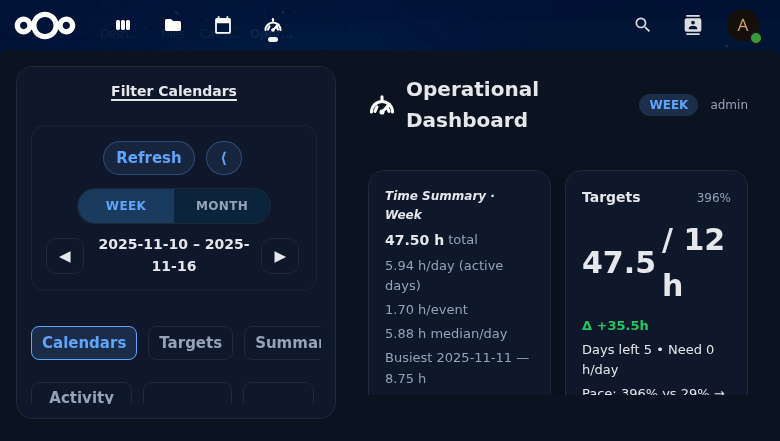

# Opsdash — Operational Calendar Dashboard for Nextcloud


> ✨ *Your calendar time, but actually useful.* Opsdash aggregates events, compares them to your targets, keeps balance visible, and stays 100 % inside your Nextcloud instance.

## 📸 UI Preview *(placeholders for 0.4.x)*
| Overview | Theme |
| --- | --- |
|  |  |
| Targets | Balance |
|  |  |

## 💡 Why teams install Opsdash
- **Know where the week went** – totals, averages, busiest days, workday/weekend split, top categories, longest tasks.
- **Stay on target** – per-calendar & per-category goals with pacing badges, Δ indicators, and quick forecasting.
- **Balance at a glance** – stacked bars, category pies, heatmaps, and configurable chart widgets inside dashboard tabs.
- **Onboarding & presets** – pick Quick/Standard/Pro dashboard presets in the wizard, snapshot the sidebar, rerun onboarding from the Calendars tab, and keep teammates aligned with shared profiles.
- **Notes + theming** – week/month notes (editable + read-only history) and per-user theme preferences that load instantly even after clearing cache.
- **Native & private** – Vue 3 SPA rendered via Nextcloud’s CSP, CSRF, and permissions. No telemetry, no external APIs.

## 🧭 Compatibility Matrix
| Branch | NC support | Version |
| --- | --- | --- |
| `master` | NC 31 | 0.4.x (current) |
| `release/0.4.x` | NC 31 | App Store-ready builds |
| `feature/nc32` *(planned)* | NC 32 | 0.5.x once CI passes |

Install via the Nextcloud App Store (once published) **or** drop the `opsdash` folder inside `custom_apps/` and enable it:
```bash
occ app:enable opsdash
```

## 🚀 Feature Rundown
- 📅 **Dashboard** – KPIs for week/month, busiest days, averages, weekend share, per-category chips, longest events, and multi-tab layouts.
- 🎯 **Targets & pacing** – per calendar/category goals, pace hints, momentum forecasts, daypart insights, and badges.
- ⚖️ **Balance** – share cards, stacked bars, relations/ratios, trend lookback, heatmaps, longest sessions, daypart toggles.
- 🧠 **Notes** – edit “This week/month”, read “Last week/month”, optional display on the Balance card.
- 🧩 **Onboarding wizard & presets** – guided setup (calendars, targets, Deck boards, reporting cadence, Activity heatmap toggle), rerun from Calendars, save/load/delete presets, export/import, theme selector.
- 🗓️ **Activity & schedule** – KPIs for events/active days plus a “Days off” heatmap that compares the current range with the last few weeks/months.
- 🔐 **Nextcloud-native** – same theme, request token, permissions, Dav colors, and zero external calls.
- 🗂️ **Deck widgets** – Deck cards widget with per-widget board/filter selection, auto-scroll ticker, counts; optional Deck summary widget.
- 📨 **Report tab (preview)** – configure weekly/monthly digests, interim reminders, and Deck visibility using Nextcloud notifications + email.
- 📐 **Widget sizing controls** – per-widget width/height plus Scale/Dense tuning; use these to fit content without scrolling.

## 🛠 Local Development
```bash
# install deps & build assets
cd opsdash
npm ci
npm run build
composer install

# unit/integration tests
npm run test -- --run    # Vitest
composer run test:unit   # PHPUnit

# Playwright smoke suite (Chromium only)
npx playwright install --with-deps chromium
npm run test:e2e
```

Smoke-check a running Nextcloud container (defaults: `nc31-dev admin/admin`):
```bash
make smoke
```

### Packaging (App Store tarball)
```bash
# from repo root
make appstore VERSION=0.4.7
```
This runs a clean copy into `build/opsdash`, installs deps, builds, strips dev files, and outputs `build/dist/opsdash-<version>.tar.gz`. If your environment blocks native binaries during `npm ci` (esbuild), rerun with sufficient permissions so the esbuild helper can execute.

## 🧪 QA Seeding & Fixtures
```bash
# run from Nextcloud root
php apps/opsdash/tools/seed_qa_calendars.php
QA_USER=admin php apps/opsdash/tools/seed_deck_boards.php
QA_USER=qa php apps/opsdash/tools/seed_deck_boards.php

# or from the repo root (executes OCC inside the docker container, default nc31-dev)
./tools/seed_opsdash_occ.sh         # seeds calendars + Deck (admin/qa/qa2)
./tools/seed_deck_occ.sh            # seeds admin + qa
NEXTCLOUD_CONTAINER=nc-ci ./tools/seed_deck_occ.sh admin qa extrauser
```
Seeds the `opsdash-focus` calendar plus deterministic Deck boards/cards used by Playwright and fixture captures. The OCC command is CI-friendly (resets stacks by default, supports `--board-title`, `--board-color`, `--keep-stacks`). Additional fixtures (load/persist/notes/deck) live under `opsdash/test/fixtures/` with capture instructions.  
The helper script now shells into your container and invokes `apps/opsdash/tools/seed_deck_boards.php` with the relevant `QA_*` env vars (`QA_DECK_BOARD_TITLE`, `QA_DECK_BOARD_COLOR`, `QA_DECK_KEEP_STACKS`).

## 📋 Roadmap Highlights
- NC 31 releases in `0.4.x` stream; NC 32 (`0.5.x`) lands once CI matrices stabilize.
- Balance config simplified: server rounds ratios to 1 decimal, precision toggles are gone, and Balance lookback defaults to 4 weeks to keep week/month history aligned.
- Deck integration spike (see `docs-private/opsdash-docs/DECK_INTEGRATION.md`) and reporting concept for NC App Store metadata.
- i18n workflow (`npm run i18n:scan` / `npm run i18n:extract`) ready — de/fr/es packs coming.

## 🙌 Contributing
1. Fork & clone.
2. Work on a branch, keeping fixtures/docs updated.
3. Run Vitest + PHPUnit before opening a PR.
4. For Playwright fixes, add/update QA fixtures or seeding scripts as needed.

### Architecture note
The `/overview/load` flow lives in `OverviewController.php` and is being carved into services (`OverviewEventsCollector`, `OverviewAggregationService`, etc.) so aggregation, sanitisation, and HTTP wiring stay separate. Write endpoints are already split into dedicated controllers (`PersistController`, `NotesController`, `PresetsController`). Keep tests/fixtures in sync whenever backend payloads change.

Happy dashboarding! 🎉
