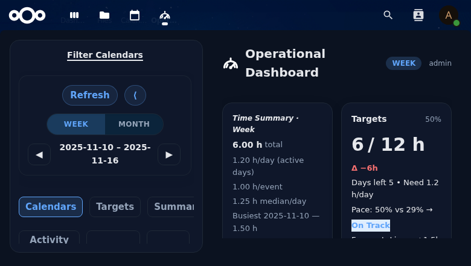
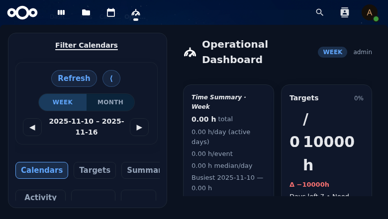

# Opsdash — Operational Calendar Dashboard for Nextcloud


Opsdash turns raw calendar data into actionable week/month insights inside Nextcloud. It ships as a privacy-preserving app (no telemetry, user-scoped config storage) and targets the NC 31 line today while we stage NC 32 support.

## Screenshots

| Week view (cards + charts) | Month view (targets + balance) |
| --- | --- |
|  |  |

## Feature Highlights
- **Dedicated SPA** powered by Vue 3 + Vite: fast navigation, collapsible sidebar, onboarding wizard, and dark/light auto theme.
- **Targets + pacing**: per-calendar weekly/monthly targets, Δ, badges, pace hints, and forecast overlay (linear vs. calendar/category modes).
- **Charts & tables**: stacked bars, pie, calendar-by-category tables, longest tasks, heatmap, balance index, and activity breakdowns (weekend share, overlaps, earliest/latest, etc.).
- **Notes & presets**: jot context per range and save/load named presets (sanitised and scoped per user).
- **No telemetry**: the app never leaves your server; all configs live in Nextcloud’s config backend.

## Compatibility & Branching

| Branch | NC support | Version line | Notes |
| --- | --- | --- | --- |
| `master` | NC 31 | 0.4.x | Active development (architecture refactor, onboarding revamp). |
| `release/0.4.x` | NC 31 | 0.4.x | Cut from `master` for App Store submissions (e.g., `release/0.4.5`). |
| *(staged)* | NC 32 | 0.5.x | Matrix entries exist in `.github/ci-matrix.json` but stay disabled until `info.xml` widens. |

See `opsdash/docs/BRANCHING.md` for the full branching + release plan.

## Local Development
1. **Bootstrap Nextcloud**: use the provided docker-compose files (`docker-compose31.yml` or `docker-compose.yml`) or follow `opsdash/docs/DEV_WORKFLOW.md` to mount the app under `custom_apps/opsdash`.
2. **Install deps & build**:
   ```bash
   cd opsdash
   npm ci
   npm run build
   composer install
   ```
3. **Enable + seed**: `occ app:enable opsdash`, install the Calendar app, then run the seeding helpers from `opsdash/tools/seed/` (documented in `docs/SEEDING.md`).
4. **Vite dev server** (optional): `cd opsdash && npm run dev` to hot-reload the SPA; Nextcloud still serves the built assets, so rebuild before packaging.

## Testing & CI
- **Local commands**
  - `npm run test -- --run` (Vitest suites for composables/components/services).
  - `composer run test:unit` (PHPUnit controllers/services).
  - `npm run test:e2e` (Playwright smoke tests for dashboard load, onboarding rerun, and preset saves; requires `npx playwright install --with-deps chromium`).
  - `npm run build` (ensures `js/.vite/manifest.json` matches hashed assets).
- **GitHub Actions** (`.github/workflows/server-tests.yml`)
  - Reads `.github/ci-matrix.json` and runs every enabled combo (currently `stable30/stable31 × PHP 8.2/8.3`).
  - Steps: checkout `nextcloud/server@branch`, rsync Opsdash into `server/apps/opsdash`, `npm ci → test → build`, install PHP deps, `occ maintenance:install`, run PHPUnit + Playwright, upload per-matrix artifacts.
- **Security smoke scripts**
  - `tools/security/run_curl_checks.sh` (range/offset clamp, CSRF header, preset sanitisation, notes injection) now relies on basic auth instead of the legacy form login.
  - Additional helpers (`tools/security/import_fuzz.sh`, `tools/security/preset_roundtrip.sh`, `opsdash/tools/security/run_notes_csrf.sh`) cover config import/export, preset roundtrips, and notes CSRF scenarios.

## Security & Pentest Workflow
- Pentest plan/log: `opsdash/docs/PENTEST_PLAN.md`, `opsdash/docs/PENTEST_LOG.md` (updated 2025‑11‑10 with DevTools, preset roundtrip, and notes CSRF automation evidence).
- Follow `docs/INTEGRATION_TESTING.md` to spin up a reproducible Nextcloud server, seed calendars via OCC, and capture curl payloads.
- Manual scripts stay out of CI; run them before tagging releases to keep white-box coverage fresh.
- Server hardening tips and CSP references live in `opsdash/docs/SECURITY.md` & `opsdash/docs/OPERATIONS.md`.

## Documentation Map
- **Architecture & APIs**: `opsdash/docs/ARCHITECTURE.md`, `opsdash/docs/API.md`, `opsdash/docs/DIRECTORY_STRUCTURE.md`.
- **Dev workflow**: `opsdash/docs/DEV_WORKFLOW.md`, `opsdash/docs/CALENDAR_DEV_SETUP.md`, `opsdash/docs/CONFIGURATION.md`.
- **Testing roadmap**: `opsdash/docs/TESTING_STRATEGY.md`, `opsdash/docs/TESTING_IMPROVEMENT_PLAN.md`, `opsdash/docs/NEXT_STEPS.md`.
- **Security/pentest**: `opsdash/docs/SECURITY.md`, `opsdash/docs/PENTEST_PLAN.md`, `opsdash/docs/PENTEST_LOG.md`.
- **Release/packaging**: `opsdash/docs/PACKAGING.md`, `opsdash/docs/APP_STORE_PUBLISHING.md`, `opsdash/docs/PUBLISHING_CHECKLIST.md`, `opsdash/docs/RELEASE.md`.

## Release Workflow
1. Bump versions (`opsdash/VERSION`, `appinfo/info.xml`, `package.json`) and update `opsdash/docs/CHANGELOG.md`.
2. Run the full test suite + security scripts.
3. `npm run build && composer install --no-dev` to prep artifacts.
4. Package/sign via `pack_opsdash.sh` (calls Nextcloud’s `integrity:sign-app`).
5. Cut `release/<line>` branch, create Git tag (e.g., `v0.4.5`), and upload to the App Store.

## License
AGPL‑3.0-or-later. See `LICENSE` for details.
