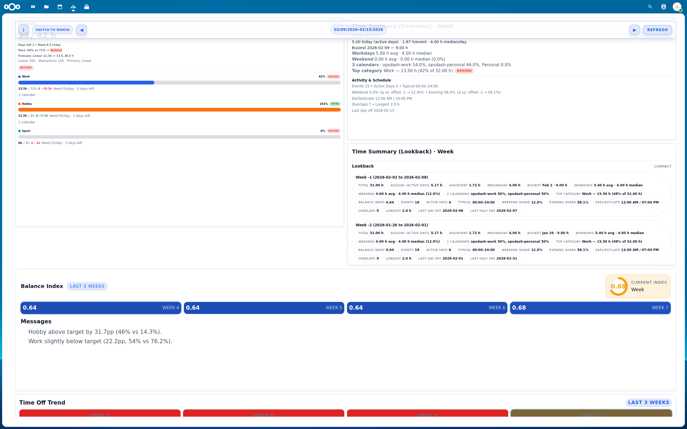
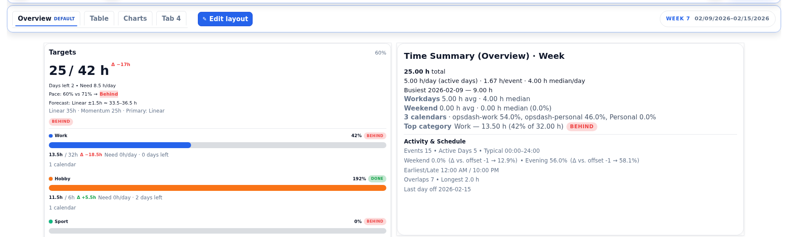
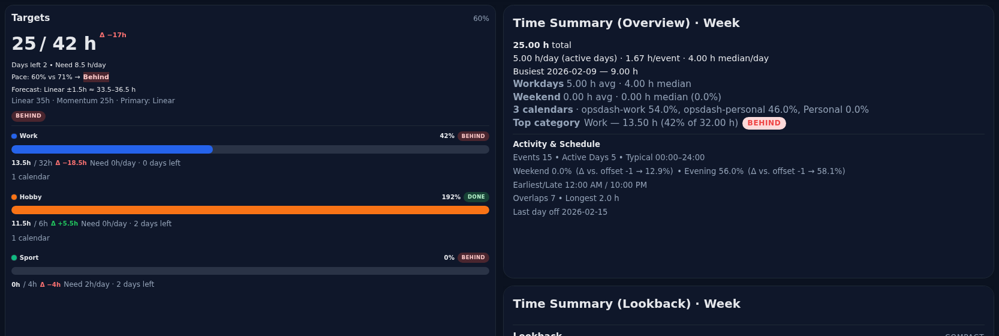
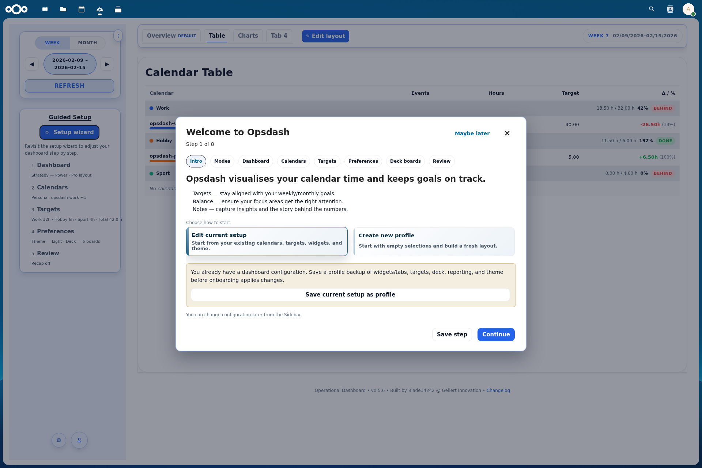
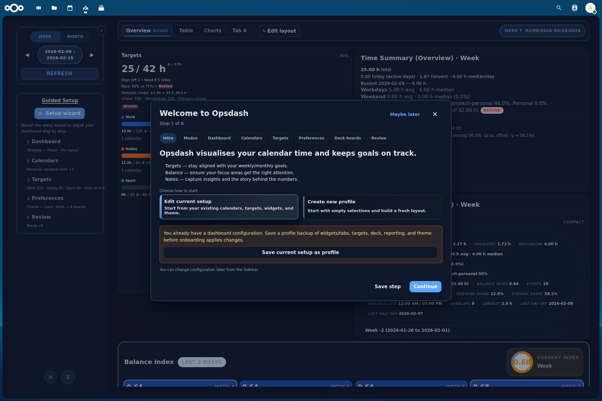
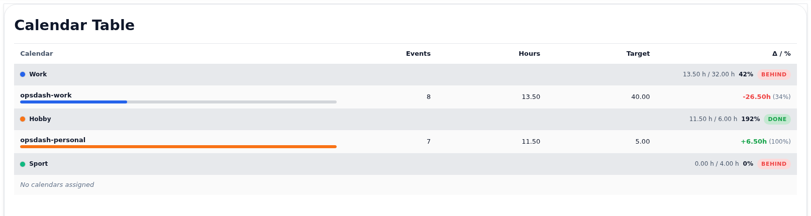
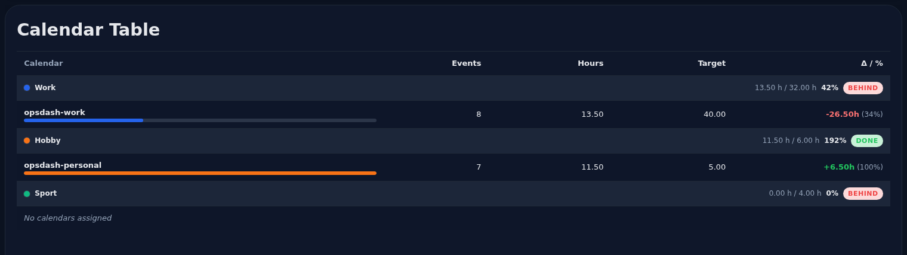

# Opsdash - Operational Calendar Dashboard for Nextcloud


Opsdash turns your Nextcloud calendar data into a practical operations dashboard: what happened, what is on target, and where your time is drifting.

## 🚀 Feature Rundown
- 📅 **Dashboard** – KPIs for week/month, busiest days, averages, weekend share, top categories, longest events, and multi-tab layouts.
- 🎯 **Targets & pacing** – per-calendar and per-category goals, pace hints, trend context, and forecast signals.
- ⚖️ **Balance** – share cards, stacked bars, relations/ratios, heatmaps, lookback trends, and daypart toggles.
- 🧠 **Notes** – edit “This week/month”, view “Last week/month”, and optionally surface notes in cards.
- 🧩 **Onboarding wizard & profiles** – guided setup, rerun onboarding, and save/load/delete/export/import profile presets.
- 🗓️ **Activity & schedule** – event and active-day KPIs plus “Days off” trend heatmaps.
- 🔐 **Nextcloud-native** – same session, same permissions, CSRF-protected writes, no external API calls.
- 🗂️ **Deck widgets** – per-widget board/filter selection, auto-scroll ticker, counts, duplicate-tag disambiguation by board context, and optional deck summary.
- 📨 **Report tab (preview)** – configure weekly/monthly digest preferences and reminder behavior.
- 📐 **Widget sizing controls** – per-widget width/height plus scale/dense options for layout tuning.

## Screenshots


| Widgets (Light) | Widgets (Dark) |
| --- | --- |
|  |  |

| Onboarding (Light) | Onboarding (Dark) |
| --- | --- |
|  |  |

| Calendar Table (Light) | Calendar Table (Dark) |
| --- | --- |
|  |  |

## Compatibility
| Branch | Nextcloud | App version |
| --- | --- | --- |
| `master` | 30-32 | 0.5.8 |
| `release/0.5.x` | 30-32 | Store-ready line |

## Install
Install from the Nextcloud App Store (when published) or place `opsdash` in `custom_apps/` and enable it:

```bash
occ app:enable opsdash
```

## Development
```bash
cd opsdash
npm ci
composer install
npm run build
npm run test:unit
composer run test:unit
PLAYWRIGHT_BASE_URL=http://localhost:8088 npm run test:e2e
```

Quick smoke check:
```bash
make smoke
```

## Packaging
```bash
make appstore VERSION=0.5.8
```

Produces `build/dist/opsdash-<version>.tar.gz` (unsigned).  
Sign separately with `occ integrity:sign-app`.

## Contributing
1. Keep PRs focused.
2. Update docs and fixtures when payloads change.
3. Run unit tests before opening a PR.
